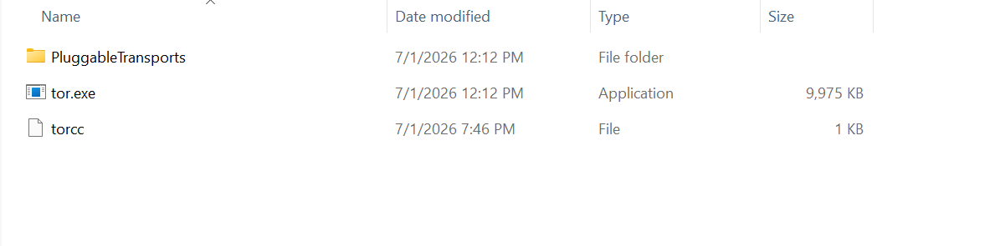

# torchat
# Part 1
## How to convert wif to Onion Address
## Download

[📥 Download tor-key-converter.html](https://github.com/ranchimall/torchat/blob/main/tor-key-converter.html)

Enter your wif and it will download three files:
1. hostname
2. hs_ed25519_public_key
3. hs_ed25519_secret_key

# Part 2
## How to setup TOR from the generated secret key
## Step 1: Download TOR browser
[📥 Download TOR browser](https://www.torproject.org/download/)

## Step 2. Find tor.exe
It is usually located at:
C:\Users\<YourUser>\Desktop\Tor Browser\Browser\TorBrowser\Tor\tor.exe
or
C:\Program Files\Tor Browser\Browser\TorBrowser\Tor\tor.exe

## Verify that you have:
tor.exe
and
torrc-defaults

## Step 3. Create a torrc file
In the same directory as tor.exe, create a file called:
torrc

The extension of the file will be nothing, only torcc

## Enter these values inside the new torcc file
HiddenServiceDir C:\TorHiddenService
HiddenServicePort 80 127.0.0.1:8765
HiddenServiceVersion 3
SocksPort 9050

## Save it

## Step 4. Create the directory TorHiddenService

Create a folder
C:\TorHiddenService

## Very important
Copy your generated secret key from Part 1 inside TorHiddenService
C:\TorHiddenService\hs_ed25519_secret_key

## Step 5. Start Tor
Open CMD.

Go to the Tor folder.

Example:
cd "C:\Program Files\Tor Browser\Browser\TorBrowser\Tor"

Run
tor.exe -f torrc

You'll see something similar to
Bootstrapped 100% (done)

## This will update your C:\TorHiddenService with
hostname
hs_ed25519_public_key
hs_ed25519_secret_key

# Part 3
## How to run the audio video chat app on TOR

