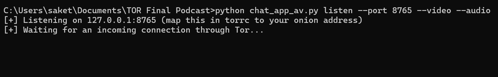

# torchat

## Pre requisites
### 1. Python 3.8+

### 2. Tor (the actual Tor daemon — not a Python package)
This app talks to a Tor SOCKS proxy running on your machine (127.0.0.1:9050 by default). You need Tor itself installed and running locally, on both sides of the chat.

### 3. Hidden service setup (host / listen side only) 
Only the person running in listen mode needs this — the person who connects does not.
### This is explained step by step in Part 2: Step 4 of this guide

### 4. Python packages
   ### connect mode (dialing out via Tor SOCKS):
   pip install PySocks --break-system-packages
   ### video
   pip install opencv-python numpy --break-system-packages
   ### audio
   pip install sounddevice numpy opuslib --break-system-packages

   ### To install everything at once:
   pip install PySocks opencv-python numpy sounddevice opuslib --break-system-packages

### 5. libopus (system library, for --audio only)
   macOS
   brew install opus
   
   Linux (Debian/Ubuntu)
   sudo apt install libopus0
   
   Windows
   Requires an opus.dll available on your system PATH (or placed next to your Python executable).

### Opus Widnows Setup

Audio calls require the native Opus library in addition to the Python package.

### 1. Install Python package

```bash
pip install opuslib
```

### 2. Install Opus DLL using MSYS2

Install MSYS2 from:

https://www.msys2.org/

Open the **MSYS2 MINGW64** terminal and run:

```bash
pacman -S mingw-w64-x86_64-opus
```

This installs:

```
C:\msys64\mingw64\bin\libopus-0.dll
```

### 3. Configure the application

If the application cannot automatically locate the Opus library, edit:

```
Python\Lib\site-packages\opuslib\api\__init__.py
```

Replace:

```python
lib_location = find_library("opus")

if lib_location is None:
    raise Exception(
        "Could not find Opus library. Make sure it is installed.")

libopus = ctypes.CDLL(lib_location)
```

with:

```python
lib_location = find_library("opus")

# Windows fallback
if lib_location is None:
    lib_location = r"C:\msys64\mingw64\bin\libopus-0.dll"

libopus = ctypes.CDLL(lib_location)
```

### 4. Verify

Run:

```bash
python -c "import opuslib; print('Opus loaded successfully')"
```

If you see:

```
Opus loaded successfully
```

then the audio dependency has been installed correctly.  

# TOR Chat Setup

# Part 1
## How to convert wif to Onion Address
## Download TOR Key Converter

[📥 Download tor-key-converter.html](https://github.com/ranchimall/torchat/blob/main/tor-key-converter.html)

## Open the html in a browser:
Enter your FLO or BTC blockchain wif, Click button: "Convert WIF → Tor Keys", and it will download three files:
1. hostname
2. hs_ed25519_public_key
3. hs_ed25519_secret_key

# Part 2
## How to setup TOR from the generated secret key
## Step 1: Download TOR browser
[📥 Download TOR browser](https://www.torproject.org/download/)

## Step 2. Find tor.exe
It is usually located at:
C:\Users\<YourUser>\Desktop\Tor Browser\Browser\TorBrowser\Tor\tor.exe
or
C:\Program Files\Tor Browser\Browser\TorBrowser\Tor\tor.exe

## Verify that you have:
tor.exe
and
torrc-defaults

## Step 3. Create a torrc file
In the same directory as tor.exe, create a file called:
torrc

The extension of the file will be nothing, only torcc


## Enter these values inside the new torcc file
HiddenServiceDir C:\TorHiddenService
HiddenServicePort 80 127.0.0.1:8765
HiddenServiceVersion 3
SocksPort 9050

## Save it

## Step 4. Create the directory TorHiddenService

Create a folder
C:\TorHiddenService

## Very important
Copy your generated secret key from Part 1 inside TorHiddenService
C:\TorHiddenService\hs_ed25519_secret_key

## Step 5. Start Tor
Open CMD.

Go to the Tor folder.

Example:
cd "C:\Program Files\Tor Browser\Browser\TorBrowser\Tor"

Run
tor.exe -f torrc

You'll see something similar to
Bootstrapped 100% (done)

## This will update your C:\TorHiddenService with
hostname
hs_ed25519_public_key
hs_ed25519_secret_key

# Part 3
## How to run the audio video chat app on TOR

## Step 1
## Download the standalone python code for the chat app
[📥 Download chat_app_av.py](https://github.com/ranchimall/torchat/blob/main/chat_app_av.py)

## Step 2
## Copy the python code in a path of your choice.
Example: C:\Users\<Your User>\Documents\TOR Chat\chat_app_av.py

## Step 3
## Run the python script
Open CMD.

Go to the Chat App folder.

Example:
C:\Users\<Your User>\Documents\TOR Chat

Run
python chat_app.py listen --port 8765 --video --audio

You will see a screen like this inside the terminal


## You are now waiting another peer to join your TOR chat connection

## Step 4
## Copy your hostname or Onion address
Go to C:\TorHiddenService
Open the file "hostname" with any note editor

## Your onion address is something like this with a .onion extension
xyikvsf3e55rqwdbhycxjurop6fmj7cs9du7jcb5khk67dxfy2tapuqid.onion

## Copy the onion address
## Send it to the peson or peer who wants to connect to your TOR chat network

## Step 5 (Very Important)
## Your peer will need to start TOR using the same command

CMD
cd "C:\Program Files\Tor Browser\Browser\TorBrowser\Tor"

Run
tor.exe -f torrc

## Step 6
## Once the TOR is connected (Bootstrapped 100% (done)
The peer will need to run this command to connect to your TOR chat network

python chat_app_av.py connect --onion <Your Onion Address .onion> --port 80 --video --audio

## TOR Chat is now connected
### Both you and the peer will see the chat window in the opened terminal.
### Your webcam will open
### A text based chat can be used inside the terminal running the chat_app_av.py command

## Note:
## In any case, the TOR must be always running to connect to the chat app 


